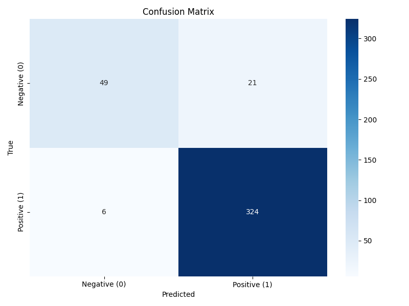
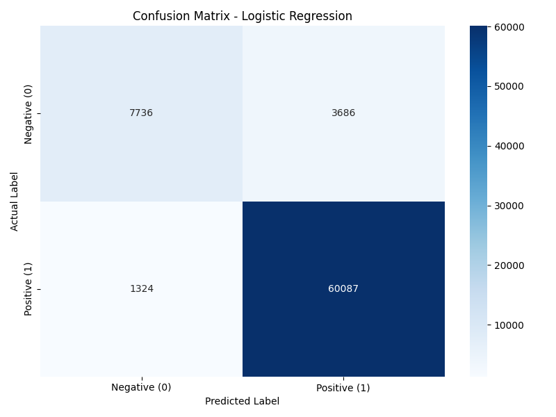
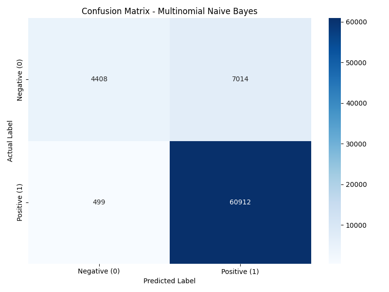
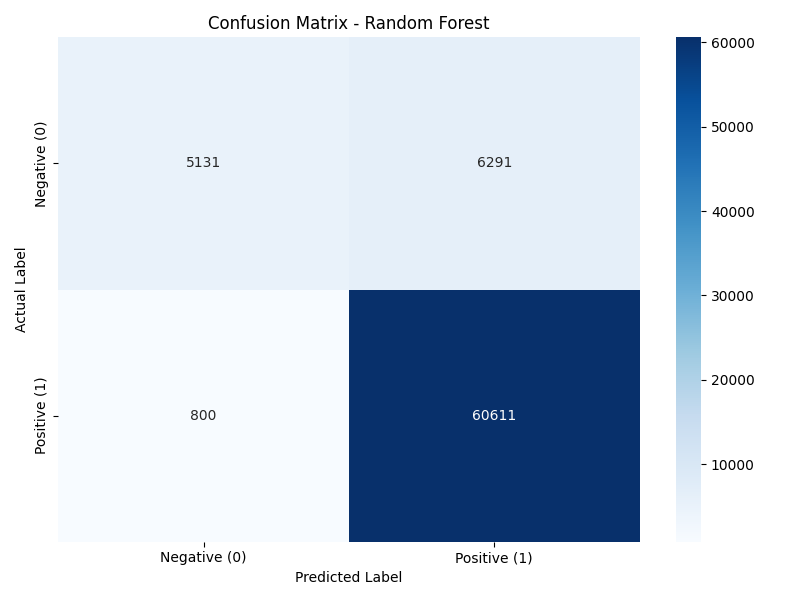
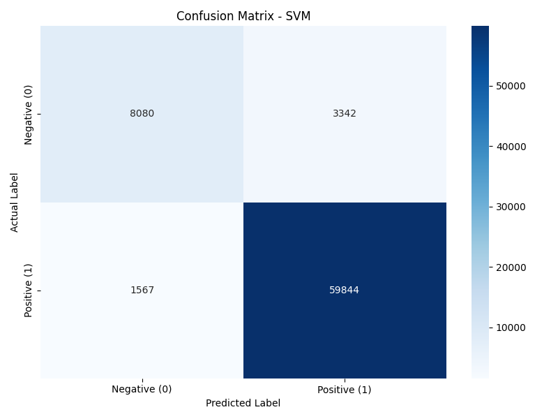
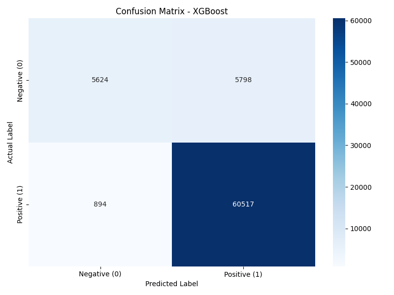
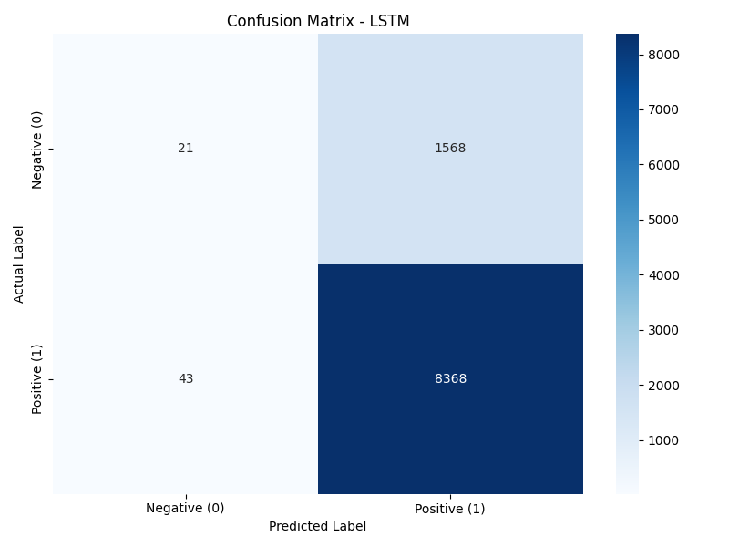
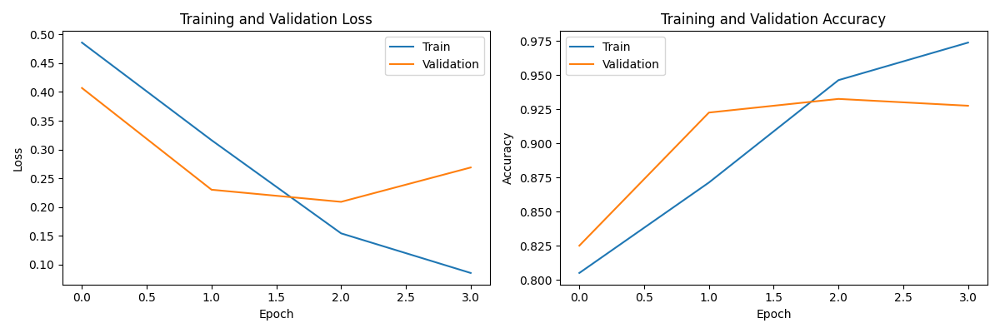
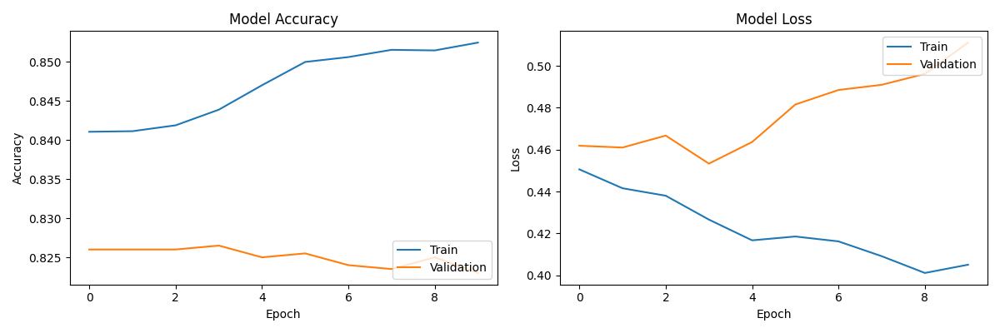
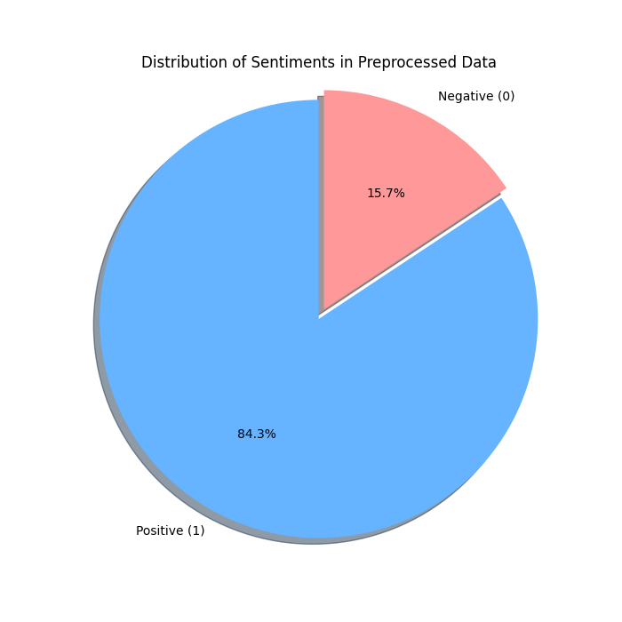

# 🧠 Advanced Sentiment Analysis of Product Reviews

A sentiment analysis project evaluating machine learning and deep learning models on **Amazon Fine Food Reviews**. BERT and SVM achieved approximately **93% accuracy**, with SVM offering a better trade-off in terms of computational resources. The project includes comprehensive data preprocessing, multiple feature engineering strategies, model training, evaluation, and visualization.

---

## 📊 Dataset

**Source:** [Amazon Fine Food Reviews](https://www.kaggle.com/datasets/snap/amazon-fine-food-reviews)

---

## 📦 Features

### 🔄 Data Preprocessing
- Cleaning raw review texts  
- Handling nulls, duplicates, and outliers  
- Tokenization, lemmatization, and stopword removal  

### ⚙️ Feature Engineering
- TF-IDF Vectorization  
- Word2Vec Embeddings  
- BERT Embeddings  

### 🤖 Model Training
- Classical Machine Learning Models:
  - Logistic Regression  
  - Naive Bayes  
  - Random Forest  
  - Support Vector Machine (SVM)  
  - XGBoost  

- Deep Learning Models:
  - LSTM  
  - BERT (fine-tuned with Transformers)  

### 📈 Evaluation Metrics
- Accuracy  
- Precision, Recall, F1-score  
- Confusion Matrix  
- Training History  

---

## 🚀 Getting Started

### ✅ Requirements

Make sure the following libraries are installed:

```bash
pip install pandas numpy scikit-learn matplotlib seaborn gensim torch transformers xgboost joblib tqdm pillow
```

### 📁 Prepare the Data

1. Download the dataset and place `Reviews.csv` inside the `data/` directory.

### ▶️ Run the Notebook

Open and run all cells in **`Sentiment_Analysis_Complete.ipynb`** to go through the entire workflow.

---

## 📂 Output & Artifacts

- ✅ Model files: stored in `models/`  
- 📄 Processed datasets: stored in `data/` and `processed_data/`  
- 📊 Evaluation reports: printed and saved during execution  

---

---

## 📄 Project Report & Presentation

- **📘 Project Report:** [📄 View Report](Yadav_Akhilesh_ProjectReport.pdf)
- **📊 Project Presentation:** [📊 View PPT](Major_Project_ppt.pdf)

> These documents provide detailed insights into the methodology, experiments, results, and key takeaways from the project.

---

## 🏆 Results and Comparison

- SVM and BERT achieved ~**93% accuracy**.  
- SVM is more resource-efficient for production deployment.  
- Detailed classification reports and confusion matrices provided for each model.

---

## 📊 Visualizations

### 🔀 Confusion Matrices
| Model | Confusion Matrix |
|-------|------------------|
| BERT |  |
| Logistic Regression |  |
| Naive Bayes |  |
| Random Forest |  |
| SVM |  |
| XGBoost |  |
| LSTM |  |

### 📈 Training Histories
- **BERT**  
  

- **LSTM**  
  

### 📊 Sentiment Distribution


---

## 📄 License

**MIT License**  
© 2025 Akhilesh Yadav
